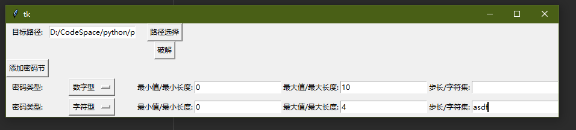
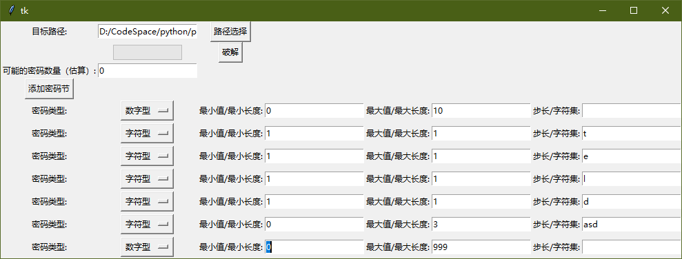

# Excel 密码破解
核心功能为尽可能利用更多已知信息探索所有可能的密码组合，不会记录密码列表，所以在密码空间超大时也不会占用太多内存
密码生成部分同样适用于其他场景

# 工具概念
## 密码节
> 密码由各种节组成，拆分成多个节可以固定密码的任意位置，减小密码空间
## 密码节类型
1. 数字型
   > 数字型密码受最大值、最小值、步进大小三个值限制  
   > 步进大小为每次尝试值与上一个值的差
2. 字符型
   > 受最小长度、最大长度、字符集限制
   > 字符集可以包含任何字符，也可以仅包含数字，与数字型密码区别为字符型受最小长度限制，会用其他字符（如0）补全左侧
   > 

# 实例
1. 左侧为 1-10数字，右侧为四位不确定顺序的字符

2. 密码为 `*teld***` 
